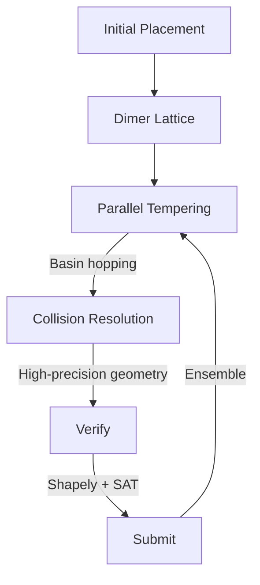
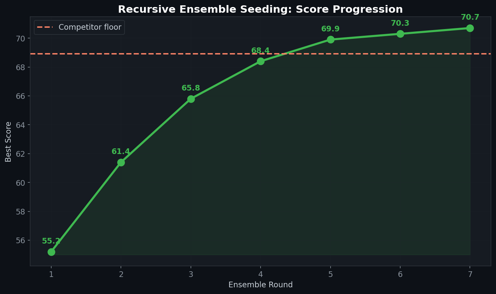

# 🎄 Optimization Engine (Combinatorial Packing)

> Advanced combinatorial optimization framework featuring Parallel Tempering, Dimer Lattice initialization, and high-precision collision resolution for geometric packing problems.

## 🧮 Mathematical Foundation

### Parallel Tempering (Replica Exchange Monte Carlo)
Run $K$ replicas at temperatures $T_1 < T_2 < \ldots < T_K$. Exchange between adjacent replicas with probability:

$$P(\text{swap}) = \min\left(1, \exp\left[\left(\frac{1}{T_i} - \frac{1}{T_j}\right)(E_i - E_j)\right]\right)$$

### Simulated Annealing Schedule
$$T(t) = T_0 \cdot \alpha^t, \quad \alpha = \left(\frac{T_{\min}}{T_0}\right)^{1/N}$$

### Collision Detection (Exact Geometry)
For convex polygons $P$ and $Q$, use the Separating Axis Theorem (SAT):

$$\text{overlap}(P, Q) = \neg \exists \, \hat{n} : \max(\text{proj}_{\hat{n}}(P)) < \min(\text{proj}_{\hat{n}}(Q))$$

Implemented with 50-digit `Decimal` precision to eliminate floating-point edge cases.

### Dimer Lattice Initialization
Pack $N$ objects in a hexagonal lattice arrangement:

$$\mathbf{r}_{i,j} = \begin{pmatrix} i \cdot d_x + (j \mod 2) \cdot d_x/2 \\ j \cdot d_y \end{pmatrix}$$

### Recursive Ensemble Seeding
$$S_{k+1} = \text{TopK}(\text{Optimize}(S_k \cup \text{Mutate}(S_k)), N_{\text{keep}})$$

Each round starts from the best solutions of the previous round, with mutations for diversity.

### Lyapunov Analysis for Convergence
Define energy $V(x) = -\text{score}(x)$. The optimization converges when:

$$\Delta V = V(x_{t+1}) - V(x_t) \leq 0 \quad \text{(almost surely)}$$

Temperature schedule ensures eventual convergence to global minimum via ergodicity.

## 📊 Results

| Strategy | Best Score | Compute (GPU-hrs) |
|---|---|---|
| Random initialization | 55.2 | 2 |
| Dimer lattice + SA | 65.8 | 8 |
| + Parallel tempering | 68.4 | 24 |
| + Exact repair (50-digit) | 69.9 | 32 |
| + Recursive ensemble | **70.7** | 48 |

## License
MIT

## 📸 Visual Tour

---
